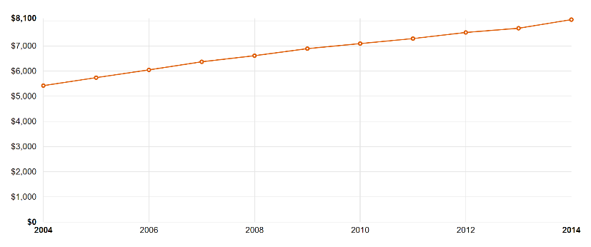
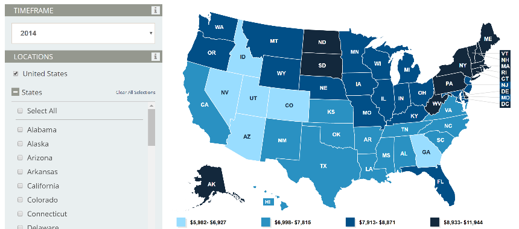
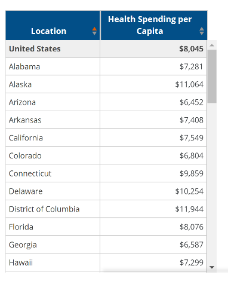
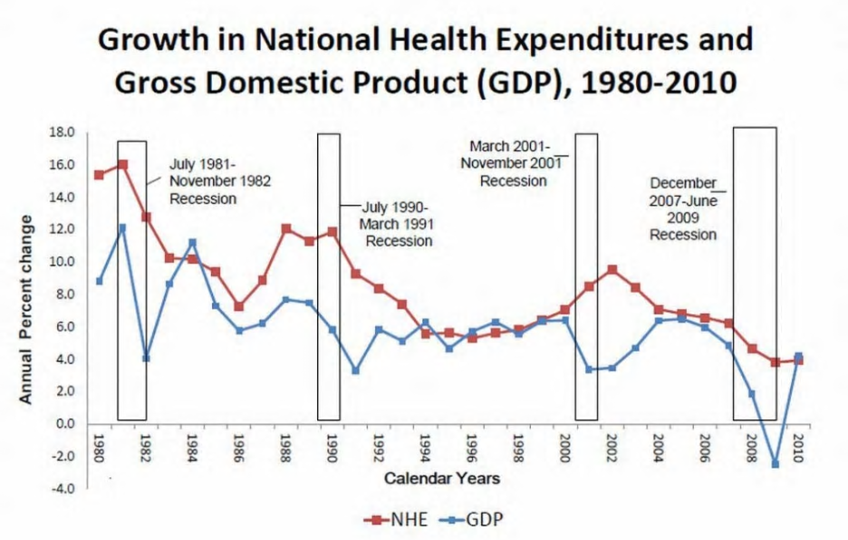

# UCB Project II Proposal

**Project Title** : Healthcare Expenditure Trends by State (2001 – 2014).

**Team Members** : Jen, Jagatha, Vijaya and Manu

**Project Description/Outline** :

Analysis of Healthcare Expenditure Trends across all states in the USA using Center for Medicare and Medicaid Services (CMS) data.

**Research Questions to Answer:**

1. Healthcare Spending by State
            1. Per Capita
            2. Private Health Insurance
            3. Public Health Insurance

2. Correlation between GDP and Healthcare Spending
3. Percentage of population have private vs public insurance.
4. Top 5 Contributing States towards Private and Public Health Insurance.

**Data Sets to be Used:**

1. CMS Health Expenditures by State - [https://www.cms.gov/Research-Statistics-Data-and-Systems/Statistics-Trends-and-Reports/NationalHealthExpendData/Downloads/resident-state-estimates.zip](https://www.cms.gov/Research-Statistics-Data-and-Systems/Statistics-Trends-and-Reports/NationalHealthExpendData/Downloads/resident-state-estimates.zip)

2. GDP Data by State - [https://www.bea.gov/regional/downloadzip.cfm](https://www.bea.gov/regional/downloadzip.cfm)

3. Global Health Expenditure - [http://apps.who.int/nha/database/Select/Indicators/en](http://apps.who.int/nha/database/Select/Indicators/en)

**References:**
1. Henry Kaiser Family Foundation -

[https://www.kff.org/other/state-indicator/health-spending-per-capita/?currentTimeframe=0&amp;sortModel=%7B%22colId%22:%22Location%22,%22sort%22:%22asc%22%7D](https://www.kff.org/other/state-indicator/health-spending-per-capita/?currentTimeframe=0&amp;sortModel=%7B%22colId%22:%22Location%22,%22sort%22:%22asc%22%7D)

2. History of Healthcare Spending - [https://www.washingtonpost.com/business/economy/the-history-of-health-care-spending-in-7-graphs/2012/01/09/gIQAFlCCmP\_gallery.html?utm\_term=.8e076fa8d884](https://www.washingtonpost.com/business/economy/the-history-of-health-care-spending-in-7-graphs/2012/01/09/gIQAFlCCmP_gallery.html?utm_term=.8e076fa8d884)

3. JS Library - [http://www.chartjs.org/docs/latest/charts/polar.html](http://www.chartjs.org/docs/latest/charts/polar.html)

**Design:**

* Our goal is to create visuals similar to the ones below.

1. 10 Year Trend 
    

2. Map  
      
    
    Table
                                                       

3. GDP Vs Healthcare Spending:
    

**GitHub Repo:**  [https://github.com/jag0717/UCB-Project2](https://github.com/jag0717/UCB-Project2)

**Rough Breakdown of Tasks** :

1. Clean up of Healthcare Spending (CMS) and GDP Data.
2. Store required data in SQLite Database.
3. Use Python Flask API&#39;s to fetch the data from Database.
4. Create an interactive Dashboard page with the following charts and update them all from the same data.

          1. Health Care Spending Trend since 2001.
          2. Health Care Expenditures per Capita by State (Geo map using Leaflet).
          3. Correlation between National GDP and Health Expenditures.

5. On the Dashboard, include a menu for
        1. Time Frame (2001 – 2014)
        2. State (All states in the US)
6. Use Chart.js library to show the percentage of people enrolled in Private Health Insurance, Medicare and Medicaid services.
